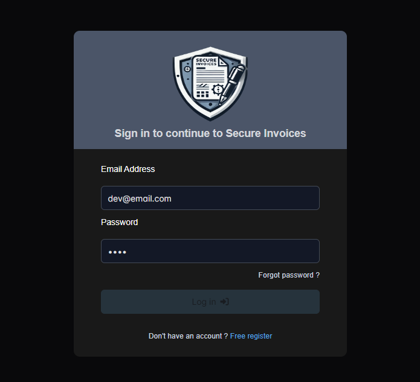
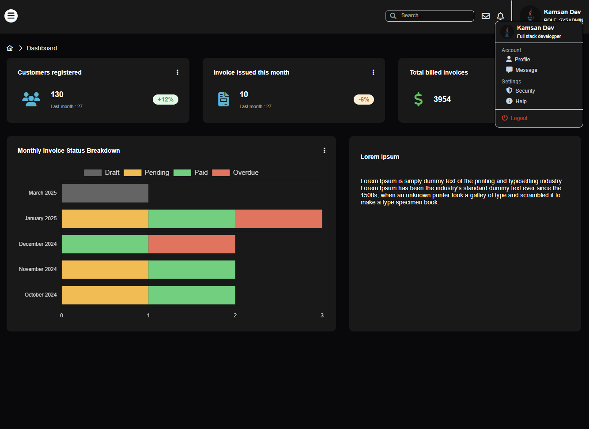
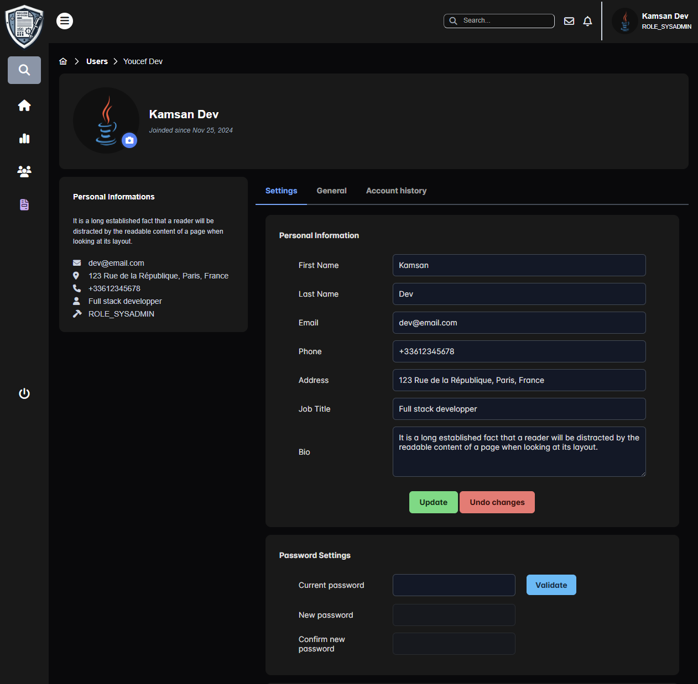
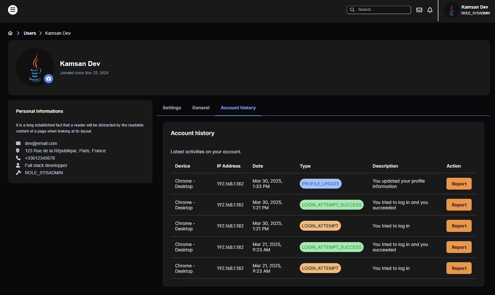
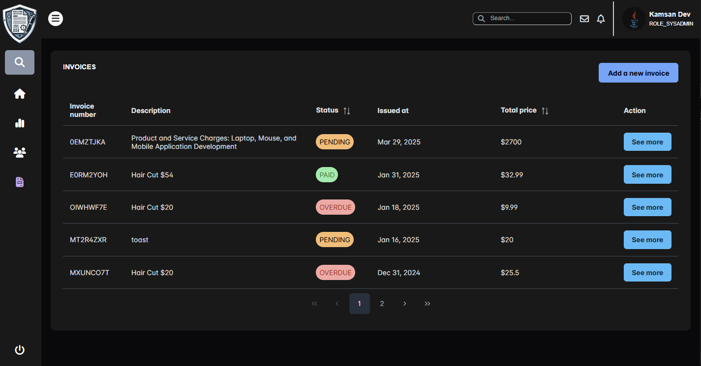
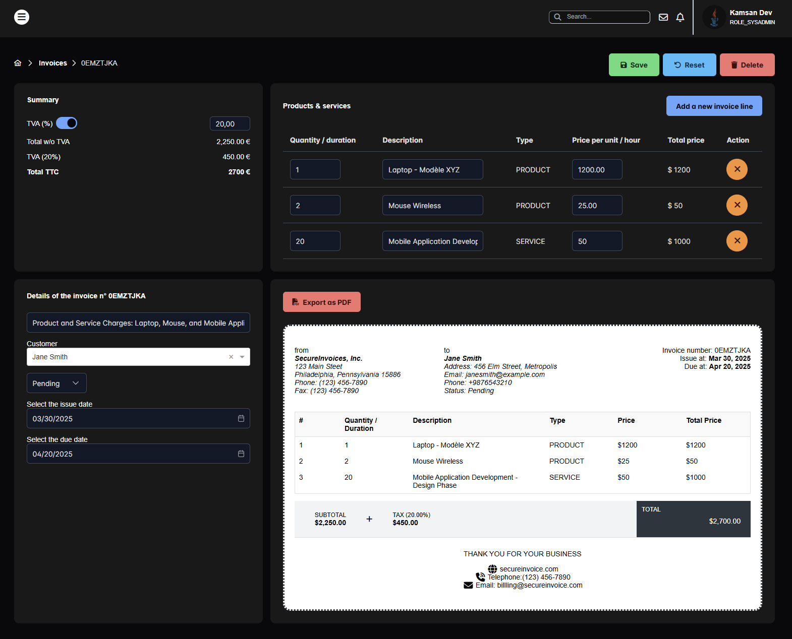

# Secure-Invoices Frontend

Secure-Invoices Frontend is the client-side application for Secure-Invoices. Built with Angular 17, PrimeNG, and Tailwind CSS, it provides an intuitive user interface for managing clients, invoices, and user profiles.

## Features

- User Authentication: Login with JWT-based authentication and 2FA.

- Client & Invoice Management: Add, edit, delete, and search clients/invoices with filters.

- User Profiles: Manage profile details with modification history.

- Admin Dashboard: Displays key statistics and analytics.

- Responsive Design: The UI is fully responsive, providing a seamless experience across desktop, tablet, and mobile devices.

## Tech Stack

- Framework: Angular 17

- UI Library: PrimeNG (for UI components such as forms, buttons, tables)

- CSS Framework: Tailwind CSS (for layout, responsiveness, sidebar, and navbar)

- API Communication: RESTful API integration

## UI Preview

#### Login

    

#### Admin Dashboard

    

#### User Profile

    

#### Account Events History

    

#### Invoices : List & Edit Section

    

    

